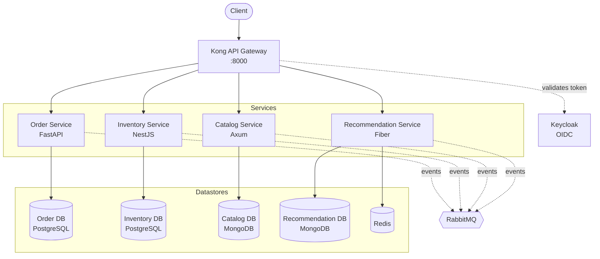
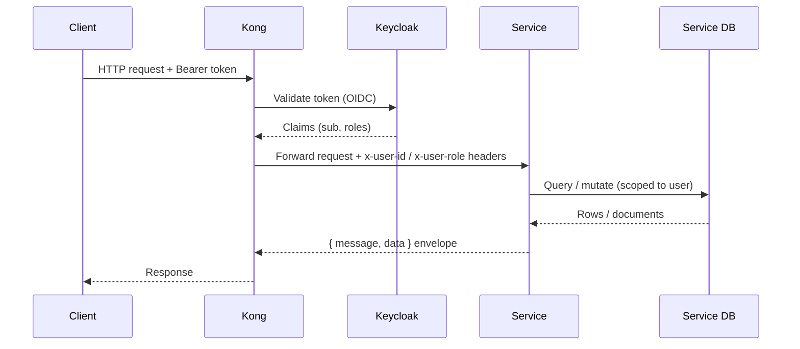

# Architecture

Polyforge follows a **database-per-service** microservices pattern. Clients talk only to the Kong gateway; Kong authenticates requests (via Keycloak), strips/injects identity headers, and routes to the owning service. Each service owns its datastore exclusively — there are no cross-service database reads.

## System topology

## Request flow

A typical authenticated request:

## Identity & authorization

- **Authentication** is handled at the edge (Kong + Keycloak). Services do **not** validate tokens themselves.
- Kong injects trusted identity headers that downstream services read:
  - `x-user-id` — the authenticated subject.
  - `x-user-role` — e.g. `administrator` vs. a regular user.
- Services apply **authorization scoping** from these headers. For example, the Order Service returns all orders for an `administrator` but only the caller's own orders otherwise.

!!! warning "Services trust the gateway"
    Because services treat `x-user-*` headers as trusted, they must **only** be reachable through Kong in any deployed environment. Never expose a service port directly.

## Cross-cutting conventions

- **Response envelope:** REST endpoints return `{ "message": string, "data": <payload> | null }`. Errors use the same shape with `data: null`.
- **Soft deletes:** where applicable (e.g. inventory items), rows are flagged with a `deletedAt` timestamp rather than physically removed; reads filter these out.
- **Audit / transaction logs:** mutating operations may append to an append-only log collection/table (see the Inventory Service).
