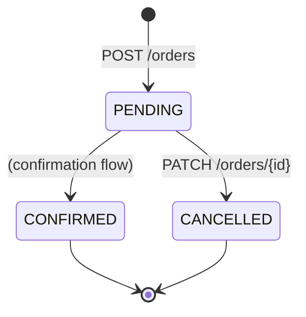
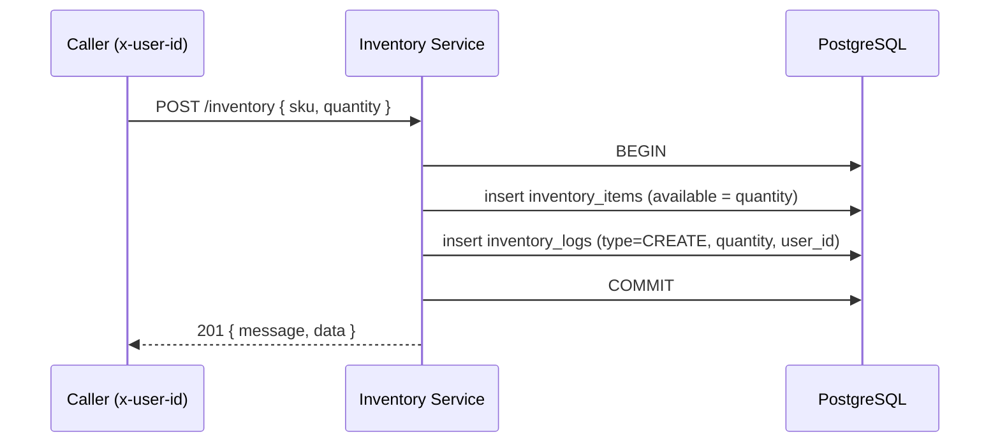
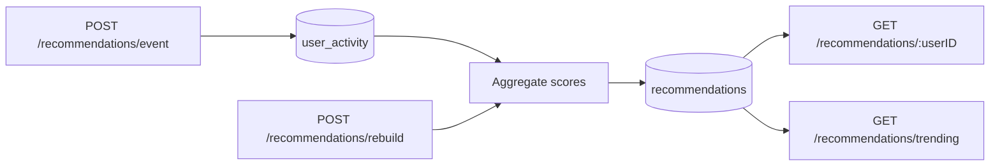

# Business Logic

Domain flows that span endpoints and (eventually) services.

## Order lifecycle

An order moves through a small state machine. Only `PENDING` orders can be cancelled.

- **Create:** `POST /orders` with `{ items: [{ sku, qty }] }` creates an order in `PENDING` for the caller (`x-user-id` → `customer_id`) and inserts its items.
- **Read scoping:** a regular user only sees their own orders; an `administrator` sees all.
- **Cancel:** `PATCH /orders/{id}` transitions a `PENDING` order to `CANCELLED`. Cancelling a non-pending or non-owned order yields a `400` / not-cancellable error.
- `CONFIRMED` exists in the model for a downstream confirmation/payment flow.

## Inventory stock movements

Every stock change is both applied to `inventory_items` and recorded in the append-only `inventory_logs`, within one transaction.

- **Create** (`CREATE` log): rejects duplicate SKU with `409`.
- **Adjust quantity** (`UPDATE` log): increments `available` by the request quantity.
- **Soft delete** (`DELETE` log): stamps `deleted_at`; the item disappears from reads but the audit row (with the quantity at deletion) remains.
- A SKU that was soft-deleted cannot currently be re-created via `POST` (the primary-key constraint still holds) — a known limitation noted in the service.

## Recommendations

- Interaction events (`view`, `add_to_cart`, `purchase`, …) are recorded per user/product.
- Aggregation produces per-product scores (`score`, `count`, `lastInteraction`) rolled up per user; a global view powers **trending**.
- `rebuild` recomputes aggregates; reads are cached in Redis.

## Cross-service consistency

The **SKU** is the shared identifier that ties the domain together: catalog products, inventory stock, order items, and recommendation events all reference the same SKU. The development seed deliberately uses one product list across catalog + inventory to keep them aligned (see [Infrastructure → Seeding](../infrastructure/index.md#seeding-development-data)).
