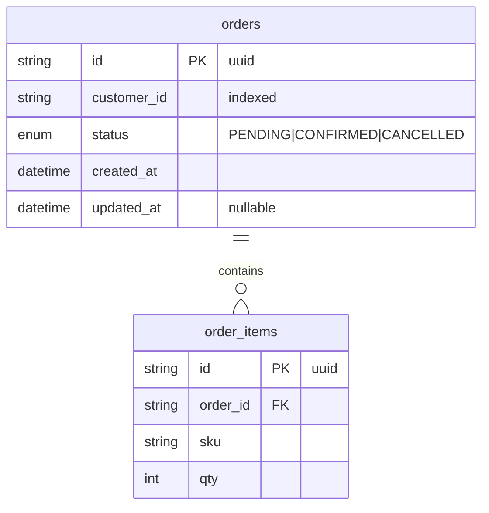
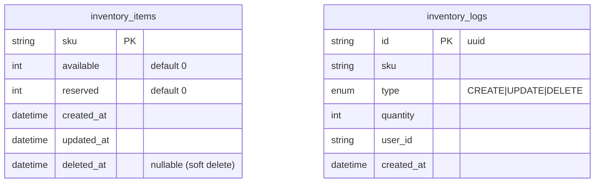
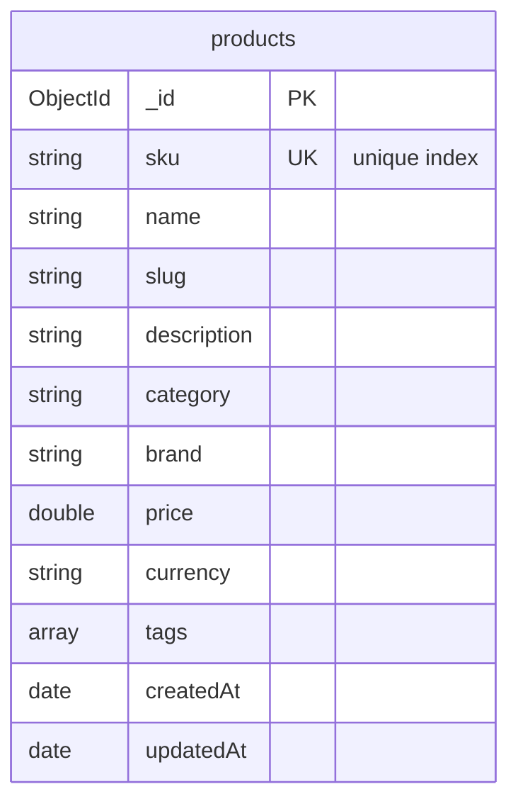
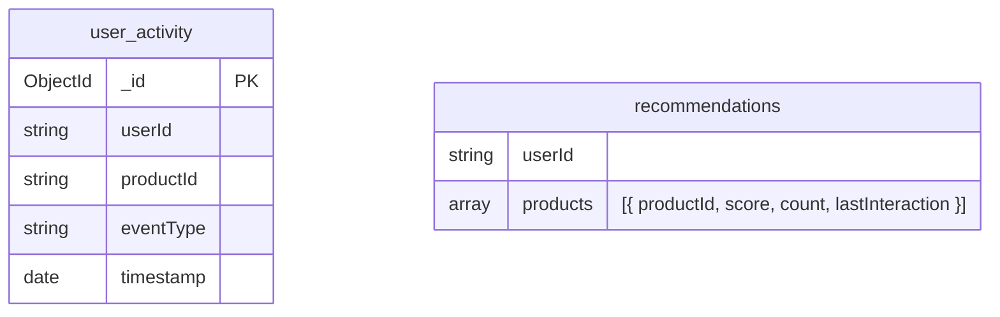

# Database Schemas

Every service owns its own database (database-per-service). Two services use PostgreSQL (relational) and two use MongoDB (document).

## Order Service (PostgreSQL)

Defined with SQLAlchemy models and Alembic migrations (`services/order-service`).

- `orders.status` is an enum (`PENDING`, `CONFIRMED`, `CANCELLED`); new orders start `PENDING`.
- `order_items` cascade-delete with their parent order.
- `customer_id` carries the `x-user-id` of the creator and drives authorization scoping.

## Inventory Service (PostgreSQL)

Defined with Prisma (`services/inventory-service/prisma/schema.prisma`).

- `inventory_items` uses `sku` as its primary key and supports soft deletes via `deleted_at`.
- `inventory_logs` is an append-only audit trail; every create/update/delete writes one row inside the same transaction as the mutation.
- `InventoryTransactionType` enum: `CREATE`, `UPDATE`, `DELETE`.

## Catalog Service (MongoDB)

Database `catalog_db`, collection `products` (shape defined by the dev seed; see [Catalog Service](../services/catalog-service.md)).

`sku` carries a unique index and is shared with `inventory_items` so catalog and stock data align.

## Recommendation Service (MongoDB)

Database on port `27018`. Documents derived from Go structs (`services/recommendation-service/internal/models`).

- `user_activity` is the raw interaction event stream.
- Recommendation aggregates store, per user, a list of `{ productId, score, count, lastInteraction }`.
